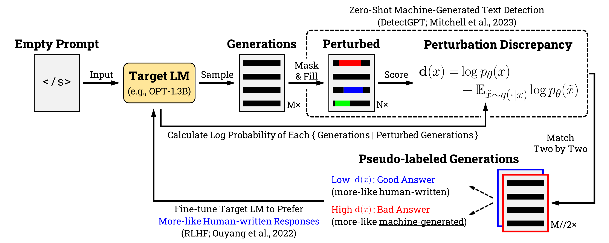

# Amplifying Exposure

This repository is the official implementation of our paper, '*Amplifying Training Data Exposure through Fine-Tuning with Pseudo-Labeled Memberships*.'
<!-- This repository is the official implementation of our paper, '*Amplifying Training Data Exposure through Fine-Tuning with Pseudo-Labeled Memberships*', the under review as a conference paper at ICLR 2024.-->
<!-- [Amplifying Training Data Exposure through Fine-Tuning with Pseudo-Labeled Memberships]().  -->



<!-- >📋  Optional: include a graphic explaining your approach/main result, bibtex entry, link to demos, blog posts and tutorials -->

## Environments

To prepare the dataset, a single GPU with 24GB of VRAM is sufficient (*e.g.*, one NVIDIA RTX 3090 GPU).

To perform PPO fine-tuning, at least two GPUs with 32GB VRAM are required (*e.g.*, two NVIDIA Tesla V100 GPUs). This environment is capable of training up to the `OPT-2.7B` model.

## Requirements

This repository requires a python 3.10 or higher environment:

```bash
python -V
>>> Python 3.10.11
```

To install requirements:

```bash
pip install --upgrade pip
pip install torch transformers easydict tqdm scikit-learn pandas==2.0 tensorboard
DS_BUILD_OPS=0 pip install transformers[deepspeed]
sudo apt-get install -y libaio-dev
```

Then use the `ds_report` command to verify that your environment is ready for inference using [DeepSpeed](https://github.com/microsoft/DeepSpeed).

```bash
ds_report
```

<!-- >📋  Describe how to set up the environment, e.g. pip/conda/docker commands, download datasets, etc... -->

## Pseudo-Labeling based on Machine-Generated Probabilities

### Generating Texts

Create a candidate training dataset from the target model:

```bash
deepspeed --num_gpus=2 extract.py \
    --pretrained_model_name facebook/opt-1.3b \
    --n_generated_samples 100_000 \
    --batch_size 256 \
    --do_sample \
    --min_new_tokens 256 \
    --max_new_tokens 256 \
    --no_repeat_ngram_size 3 \
    --top_p 0.95 \
    --top_k 40 \
    --temperature 1.0 \
    --mi_metrics ce_loss \
    --assets assets \
    --nowtime 20230927-114523 \
    --deepspeed ./ds_config/ds_config_zero3.json
```

Then you get a file named `facebook_opt-1.3b/facebook_opt-1.3b.100000.20230927-114523.json` under your assets folder. Here's an example of an element:

<details><summary> Expand </summary><p>

```json
[
    {
        "text": "If you don't mind me asking what is the reason you are considering a switch? I'm considering the same thing as well, but I've heard that the graphics are terrible.\nGraphics have been really, really good with this console. Some people have problems with a bit more motion blur, but its still a very enjoyable experience, and no one's ever said anything bad about the visuals.\nI heard the same about PS3. Then the graphics fell way off compared to the next gen.\nWell they had to push the graphics more with the ps3 as its one of the oldest consoles. But its not a problem with the switch.\nThat's good to know. If you have any links to games that you feel are worth playing on the switch I would love to see them!\nYeah, it all comes down to if you think you're going to spend the extra money. I got it for $30 CAD and its a fun and cheap game. But if you're not a hardcore gamer you might want to check out something else.\nIt's funny you say that, I've been looking at some of the other console games. One of them is \"Legend of Zelda: Breath of the Wild\", which I was originally gonna get on the PS3",
        "n_tokens": 256,
        "n_words": 208,
        "ce_loss": 2.087890625
    },
    ...
]
```

</p></details>

### Perturbing Generated Texts

We then create the perturbation discrepancy in a mask-and-fill manner for each of the generations:

```bash
deepspeed --num_gpus=2 perturb.py \
    --mask_filling_model_name t5-large \
    --pretrained_model_name facebook/opt-1.3b \
    --n_generated_samples 100_000 \
    --threshold 20 \
    --span_length 2 \
    --buffer_size 2 \
    --pct_words_masked 0.3 \
    --n_perturbed_samples 10 \
    --batch_size 128 \
    --do_sample \
    --min_new_tokens 64 \
    --max_new_tokens 256 \
    --no_repeat_ngram_size 3 \
    --top_p 0.95 \
    --top_k 40 \
    --temperature 1.0 \
    --assets assets \
    --nowtime 20230927-114523 \
    --deepspeed ./ds_config/ds_config_zero3.json
```

Then you get a file named `facebook_opt-1.3b/facebook_opt-1.3b.100000.20230927-114523.perturb.json` under your assets folder. Here's an example of an element:

<details><summary> Expand </summary><p>

```json
[
    {
        "text": "If you don't mind me asking what is the reason you are considering a switch? I'm considering the same thing as well, but I've heard that the graphics are terrible.\nGraphics have been really, really good with this console. Some people have problems with a bit more motion blur, but its still a very enjoyable experience, and no one's ever said anything bad about the visuals.\nI heard the same about PS3. Then the graphics fell way off compared to the next gen.\nWell they had to push the graphics more with the ps3 as its one of the oldest consoles. But its not a problem with the switch.\nThat's good to know. If you have any links to games that you feel are worth playing on the switch I would love to see them!\nYeah, it all comes down to if you think you're going to spend the extra money. I got it for $30 CAD and its a fun and cheap game. But if you're not a hardcore gamer you might want to check out something else.\nIt's funny you say that, I've been looking at some of the other console games. One of them is \"Legend of Zelda: Breath of the Wild\", which I was originally gonna get on the PS3",
        "n_tokens": 256,
        "n_words": 208,
        "ce_loss": 2.087890625,
        "masked_text_0": "If you don't mind me asking what is the reason you are considering a switch? I'm considering the same thing as well, but I've heard that the <extra_id_0> terrible.\nGraphics have been really, really good with this console. Some people have problems with a bit more motion blur, but its still a very enjoyable experience, and no one's ever said anything bad about <extra_id_1> heard the same about <extra_id_2> the graphics fell way off compared to the next gen.\nWell <extra_id_3> to push the graphics more with the ps3 as <extra_id_4> of the oldest <extra_id_5> its not a problem with the switch.\nThat's good to know. If you have any links to games that you <extra_id_6> worth playing on the switch I would love to see them!\nYeah, <extra_id_7> comes down to if <extra_id_8> you're going to spend the extra money. I got it for $30 CAD and <extra_id_9> fun and cheap game. But if you're not a hardcore gamer you might want to check out something else.\nIt's funny you say that, I've been looking at some of the other console games. One of them is \"Legend of Zelda: Breath of the Wild\", <extra_id_10> was originally gonna get on the PS3",
        ...,
        "masked_text_9": "If you don't mind me asking what is the reason you are considering a switch? I'm considering the same thing as <extra_id_0> I've heard that <extra_id_1> are terrible.\nGraphics have been really, really good with this console. Some people have problems with a bit more motion blur, but its still a very enjoyable experience, and no one's ever said anything bad about the visuals.\nI heard the same about PS3. <extra_id_2> graphics fell way <extra_id_3> to the next gen.\nWell they had to push the graphics more with the ps3 as <extra_id_4> of the oldest consoles. But its not a problem with the switch.\nThat's good to know. If you have any links to games that you feel <extra_id_5> playing on the switch <extra_id_6> love to see them!\nYeah, it all comes down to if you think you're going to <extra_id_7> extra money. I got it <extra_id_8> CAD and its a fun and cheap game. But if you're not a hardcore gamer you <extra_id_9> to check out something else.\nIt's funny you say that, I've been looking at some of the other console games. One of them is \"Legend of Zelda: Breath of the Wild\", which I was originally <extra_id_10> on the PS3",
        "perturbed_text_0": "If you don't mind me asking what is the reason you are considering a switch? I'm considering the same thing as well, but I've heard that the graphics have become terrible.\nGraphics have been really, really good with this console. Some people have problems with a bit more motion blur, but its still a very enjoyable experience, and no one's ever said anything bad about it. I heard the same about the ps3 the graphics fell way off compared to the next gen.\nWell yeah they try to push the graphics more with the ps3 as one of the oldest systems so its not a problem with the switch.\nThat's good to know. If you have any links to games that you believe are worth playing on the switch I would love to see them!\nYeah, honestly it comes down to if you enjoy the game and if you're going to spend the extra money. I got it for $30 CAD and it was a fun and cheap game. But if you're not a hardcore gamer you might want to check out something else.\nIt's funny you say that, I've been looking at some of the other console games. One of them is \"Legend of Zelda: Breath of the Wild\", which I was originally gonna get on the PS3",
        ...,
        "perturbed_text_9": "If you don't mind me asking what is the reason you are considering a switch? I'm considering the same thing as you, but I've heard that the graphics are terrible.\nGraphics have been really, really good with this console. Some people have problems with a bit more motion blur, but its still a very enjoyable experience, and no one's ever said anything bad about the visuals.\nI heard the same about PS3. Even then, the graphics fell way down compared to the next gen.\nWell they had to push the graphics more with the ps3 as it is one of the oldest consoles. But its not a problem with the switch.\nThat's good to know. If you have any links to games that you feel you should try playing on the switch , I'd love to see them!\nYeah, it all comes down to if you think you're going to play it and have extra money. I got it for $10 CAD and its a fun and cheap game. But if you're not a hardcore gamer you might want to check out something else.\nIt's funny you say that, I've been looking at some of the other console games. One of them is \"Legend of Zelda: Breath of the Wild\", which I was originally looking forward to playing on the PS3"
    },
    ...
]
```

</p></details>

### Calculating Perturbation Discrepancy for Each Generated Text and Pseudo-Labeling Texts through Perturbation Discrepancy

Finally, we compute the perturbation discrepancy based on the log likelihood for each text and pseudo-label based on the perturbation discrepancy:

```bash
deepspeed --num_gpus=2 detectgpt.py \
    --pretrained_model_name facebook/opt-1.3b \
    --n_generated_samples 100_000 \
    --batch_size 128 \
    --n_perturbed_samples 10 \
    --test_size 0.2 \
    --assets assets \
    --nowtime 20230927-114523 \
    --deepspeed ./ds_config/ds_config_zero3.json
```

Then you get three files named `facebook_opt-1.3b/facebook_opt-1.3b.100000.20230927-114523.perturb.pairs.train.json`, `facebook_opt-1.3b/facebook_opt-1.3b.100000.20230927-114523.perturb.pairs.eval.json`, `facebook_opt-1.3b/facebook_opt-1.3b.100000.20230927-114523.perturb.detectgpt.json` under your assets folder. Here's an example of a pseudo-labeled pair:

<details><summary> Expand </summary><p>

```json
[
    {
        "prompt": "",
        "chosen": "A bit late, but this was the first place where I came across this awesome video. I'm not a fan of the video that was originally linked, but it really speaks for itself.\n\nIf you haven't read this excellent book, check it out. It takes a deep dive into how the mind works and how the brain perceives the world around us.\nThe authors are amazing people who seem to know much more about the brain than we do.\nIf this sounds like something you would like, there are many places to download it for free.\nhttp://www.theshadesofdeath.net/\n\n\"In the end, however, the ultimate determiners of our fate are our genes. As we can see, the choice of one person over another does not make a difference. But that is exactly what those genes say they do. They are saying, in a loud voice, \u2018Be like me.\u2019\n\nThe more we realize that the genes say what they say, the more we can understand the value of love, the value and worth of friendships, the importance of community, and the importance and value of work.\"\n\nOne of the reasons people become depressed when things go wrong is the inability to process things",
        "chosen_score": -1.8647980075,
        "rejected": "If you don't mind me asking what is the reason you are considering a switch? I'm considering the same thing as well, but I've heard that the graphics are terrible.\nGraphics have been really, really good with this console. Some people have problems with a bit more motion blur, but its still a very enjoyable experience, and no one's ever said anything bad about the visuals.\nI heard the same about PS3. Then the graphics fell way off compared to the next gen.\nWell they had to push the graphics more with the ps3 as its one of the oldest consoles. But its not a problem with the switch.\nThat's good to know. If you have any links to games that you feel are worth playing on the switch I would love to see them!\nYeah, it all comes down to if you think you're going to spend the extra money. I got it for $30 CAD and its a fun and cheap game. But if you're not a hardcore gamer you might want to check out something else.\nIt's funny you say that, I've been looking at some of the other console games. One of them is \"Legend of Zelda: Breath of the Wild\", which I was originally gonna get on the PS3",
        "rejected_score": -0.3322853854,
        "score_diff": 1.5325126221
    },
    ...
]
```

</p></details>

To summarize, you should have the following files ready to go:

```plain
./assets/facebook_opt-1.3b/
├── [112M]  facebook_opt-1.3b.100000.20230927-114523.json
├── [2.2G]  facebook_opt-1.3b.100000.20230927-114523.perturb.detectgpt.json
├── [2.2G]  facebook_opt-1.3b.100000.20230927-114523.perturb.json
├── [ 22M]  facebook_opt-1.3b.100000.20230927-114523.perturb.pairs.eval.json
└── [ 88M]  facebook_opt-1.3b.100000.20230927-114523.perturb.pairs.train.json
```

<!-- >📋  Describe how to train the models, with example commands on how to train the models in your paper, including the full training procedure and appropriate hyperparameters. -->

## Reinforcement Learning with Self-Generations

### Setup

We use [DeepSpeedExamples](https://github.com/microsoft/DeepSpeedExamples), a canned repository for reinforcement learning from human feedback (RLHF). First, download the repository and install the requirements for the library:

```bash
## Download
git clone https://github.com/microsoft/DeepSpeedExamples.git

## Setup
pip install -r DeepSpeedExamples/applications/DeepSpeed-Chat/requirements.txt
```

Then move the dataset for training to the data folder. Note that training with custom json files uses fixed file names `train.json` and `eval.json`, so you need to rename the files. Also, if you use multiple versions of the OPT model (*e.g.*, OPT-2.7B or OPT-13B), you need to remove the cache files beforehand so that you build a different dataset each time:

```bash
## Make a directory
mkdir -p ./DeepSpeedExamples/applications/DeepSpeed-Chat/data/

## Remove cache
rm -rf ~/.cache/huggingface/datasets/*
rm -rf /tmp/data_files/*

## Copy train and eval data
cp ./assets/facebook_opt-1.3b/*.pairs* ./DeepSpeedExamples/applications/DeepSpeed-Chat/data/
mv ./DeepSpeedExamples/applications/DeepSpeed-Chat/data/*train.json ./DeepSpeedExamples/applications/DeepSpeed-Chat/data/train.json
mv ./DeepSpeedExamples/applications/DeepSpeed-Chat/data/*eval.json ./DeepSpeedExamples/applications/DeepSpeed-Chat/data/eval.json
```

Finally, copy the scripts for [reward model](./scripts/step2_single_node_run.sh) and [PPO fine-tuning](./scripts/step3_single_node_run.sh):

```bash
## Step2: reward model training
cp ./scripts/step2_single_node_run.sh ./training/step2_reward_model_finetuning/training_scripts/opt/single_node/

## Step3: PPO fine-tuning
cp ./scripts/step3_single_node_run.sh ./training/step3_rlhf_finetuning/training_scripts/opt/single_node/
```

### Reward Model Training

Fine-tune the reward model. The default reward model is OPT-350M:

```bash
## Run script
cd ./DeepSpeedExamples/applications/DeepSpeed-Chat/training/step2_reward_model_finetuning/
bash ./training_scripts/opt/single_node/step2_single_node_run.sh 
```

The execution results (logs and trained model weights) will be stored in `./DeepSpeedExamples/applications/DeepSpeed-Chat/training/step2_reward_model_finetuning/output`.


### PPO Fine-tuning

PPO fine-tuning of the target model:

```bash
cd ../step3_rlhf_finetuning/
bash ./training_scripts/opt/single_node/step3_single_node_run.sh facebook/opt-1.3b ../step2_reward_model_finetuning/output 3 3
```

The execution results (logs and trained model weights) will be stored in `./DeepSpeedExamples/applications/DeepSpeed-Chat/training/step3_rlhf_finetuning/output`.

### Performing TDE Attacks on the Referece Model and Fine-tuned Model

Move all models and their tensorboard logs to the assets folder:

```bash
mkdir -p ./assets/facebook_opt-1.3b/actor_ema
cp -rf ./DeepSpeedExamples/applications/DeepSpeed-Chat/training/step3_rlhf_finetuning/output/actor_ema/ ./assets/facebook_opt-1.3b
```

Then perform training data extraction (TDE) attacks:

```bash
## Extract from the reference model
deepspeed --num_gpus=2 extract.py \
    --load_file \
    --pretrained_model_name facebook/opt-1.3b \
    --n_generated_samples 100_000 \
    --n_selected_samples 100 \
    --batch_size 128 \
    --do_sample \
    --min_new_tokens 256 \
    --max_new_tokens 256 \
    --no_repeat_ngram_size 3 \
    --top_p 0.95 \
    --top_k 40 \
    --temperature 1.0 \
    --mi_metrics ce_loss ppl zlib lower window \
    --assets assets \
    --do_scoring \
    --nowtime 20230927-114523 \
    --deepspeed ./ds_config/ds_config_zero3.json

## Extract from the fine-tuned model
deepspeed --num_gpus=2 extract.py \
    --pretrained_model_name ./assets/facebook_opt-1.3b/actor_ema  \
    --n_generated_samples 100_000 \
    --n_selected_samples 100 \
    --batch_size 128 \
    --do_sample \
    --min_new_tokens 256 \
    --max_new_tokens 256 \
    --no_repeat_ngram_size 3 \
    --top_p 0.95 \
    --top_k 40 \
    --temperature 1.0 \
    --mi_metrics ce_loss ppl zlib lower window \
    --assets assets \
    --do_scoring \
    --nowtime 20230927-114523 \
    --deepspeed ./ds_config/ds_config_zero3.json
```

Finally, we will have the following files ready to go:

```plain
./assets/facebook_opt-1.3b/
├── [4.0K]  actor_ema
│   ├── [ 770]  config.json
│   ├── [446K]  merges.txt
│   ├── [2.5G]  pytorch_model.bin
│   └── [780K]  vocab.json
├── [146M]  facebook_opt-1.3b.100000.20230927-114523.extract.json (<- !! EXTRACTED FROM REFERENCE LM !!)
├── [112M]  facebook_opt-1.3b.100000.20230927-114523.json
├── [2.2G]  facebook_opt-1.3b.100000.20230927-114523.perturb.detectgpt.json
├── [2.2G]  facebook_opt-1.3b.100000.20230927-114523.perturb.json
├── [ 22M]  facebook_opt-1.3b.100000.20230927-114523.perturb.pairs.eval.json
├── [ 88M]  facebook_opt-1.3b.100000.20230927-114523.perturb.pairs.train.json
└── [141M]  facebook_opt-1.3b_actor_ema.100000.20230928-123456.extract.json (<- !! EXTRACTED FROM FINE-TUNED LM !!)
```

## Evaluation

To perform an evaluation of the extracted files, please refer to the [following repository](https://github.com/google-research/deduplicate-text-datasets). See [this issue](https://github.com/google-research/deduplicate-text-datasets/issues/3) for how to compare the two datasets.

<!-- To evaluate my model on ImageNet, run:

```eval
python eval.py --model-file mymodel.pth --benchmark imagenet
``` -->

<!-- >📋  Describe how to evaluate the trained models on benchmarks reported in the paper, give commands that produce the results (section below). -->

## Pre-trained Models and Extracted Generations

You can get fine-tuned model weights and extracted generations from our anonymous google drive. We will release the weights publicly on huggingface hub after under review.

- [Model Weights (for huggingface transformers type)](https://drive.google.com/drive/folders/1iasgIIWFzZItFdPilfn2FJSM1LpbocIq?usp=sharing)
- [Extracted Files (from reference & fine-tuned models)](https://drive.google.com/drive/folders/1HFFMtcGXwkKWSFfv8kemyxHv3YCxlDY0?usp=sharing)

<!-- >📋  Give a link to where/how the pretrained models can be downloaded and how they were trained (if applicable).  Alternatively you can have an additional column in your results table with a link to the models. -->

## Results

Our approach achieves the following performance on:

|         | [50,64) |        | [64,128) |        | [128,192) |        | [192,256) |        |  256 |        | **Total** |        |       |
|:-------:|:-------:|:------:|:--------:|:------:|:---------:|:------:|:---------:|:------:|:----:|:------:|:---------:|:------:|:-----:|
| **OPT** |   Ref.  | Tuned. |   Ref.   | Tuned. |    Ref.   | Tuned. |    Ref.   | Tuned. | Ref. | Tuned. |    Ref.   | Tuned. |  Inc. |
|   125M  |    64   |   54   |    24    |   80   |     5     |   20   |     8     |   15   |   0  |    0   |    101    |   169  | ×1.7↑ |
|   350M  |   103   |   91   |    64    |   128  |     11    |   35   |     29    |   71   |   0  |    0   |    207    |   325  | ×1.6↑ |
|   1.3B  |    58   |   241  |    38    |   337  |     0     |   52   |     1     |   139  |   0  |    6   |     97    |   775  | ×1.7↑ |
|   2.7B  |    53   |   216  |    72    |   253  |     2     |   21   |     0     |   27   |   0  |    0   |    127    |   517  | ×1.7↑ |
|   6.7B  |    87   |   174  |    57    |   220  |     1     |   53   |     0     |   98   |   0  |    0   |    145    |   545  | ×1.7↑ |
|   13B   |    87   |   347  |    101   |   394  |     5     |   27   |     0     |   18   |   0  |    0   |    193    |   786  | ×1.7↑ |

Here, *ref* refers to the reference model without fine-tuning, and *tuned* refers to the fine-tuned model with fine-tuning.

<!-- >📋  Include a table of results from your paper, and link back to the leaderboard for clarity and context. If your main result is a figure, include that figure and link to the command or notebook to reproduce it.  -->

## Reference

```latex
@article{mitchell2023detectgpt,
  title={Detectgpt: Zero-shot machine-generated text detection using probability curvature},
  author={Mitchell, Eric and Lee, Yoonho and Khazatsky, Alexander and Manning, Christopher D and Finn, Chelsea},
  journal={arXiv preprint arXiv:2301.11305},
  year={2023}
}

@article{ouyang2022training,
  title={Training language models to follow instructions with human feedback},
  author={Ouyang, Long and Wu, Jeffrey and Jiang, Xu and Almeida, Diogo and Wainwright, Carroll and Mishkin, Pamela and Zhang, Chong and Agarwal, Sandhini and Slama, Katarina and Ray, Alex and others},
  journal={Advances in Neural Information Processing Systems},
  volume={35},
  pages={27730--27744},
  year={2022}
}
```

## Citation

```latex
TBD
```

<!-- ## Contributing

>📋  Pick a licence and describe how to contribute to your code repository.  -->
